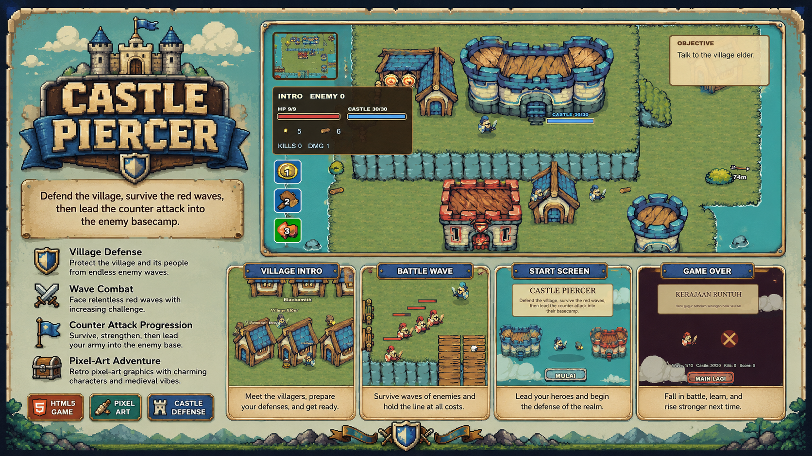

# Castle Piercer



## About the Game
Castle Piercer is an engaging 2D pixel-art action defense game built with Phaser 3. In this game, your primary duty is to protect your village and the Blue Castle from relentless waves of the Red Faction. Navigate through intensive survival phases, gather resources, and strategically counterattack the enemy basecamp to restore peace to your realm.

## Features
* Action-Packed Defense: Survive multiple waves of enemy attacks targeting your castle.
* Counter-Attack System: Once the waves are cleared, push forward to destroy the Red Castle and defeat the boss.
* Resource Management: Collect gold and wood dropped on the battlefield.
* Upgrade Mechanics: Improve your hero's combat capabilities, upgrade your blade, unlock lifesteal, and hire guards.
* Special Skills: Utilize powerful abilities like Whirlwind, Dash, and Heal to dominate the battlefield.
* Atmospheric Pixel Art: Enjoy carefully crafted pixel aesthetics, animations, and particle effects.

## How to Play
* Objectives: 
  1. Defend the Blue Castle at all costs.
  2. Gather resources to purchase upgrades between waves.
  3. Survive until the final phase.
  4. Launch a counter-offensive to destroy the Red Castle.

## Technologies Used
* Engine: Phaser 3
* Build Tool: Vite
* Level Design: Tiled

## Development Setup
To run this project locally, ensure you have Node.js installed.

1. Install the dependencies:
   ```bash
   npm install
   ```
2. Start the development server:
   ```bash
   npm run dev
   ```
3. Build for production:
   ```bash
   npm run build
   ```
